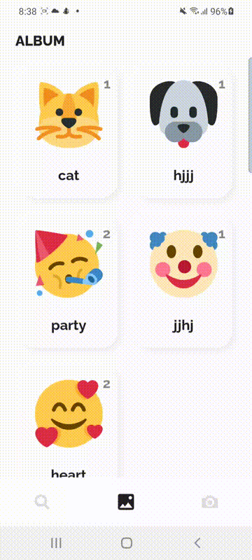
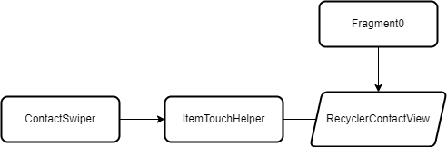
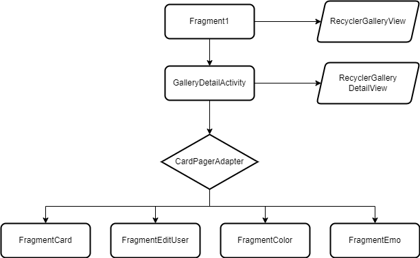
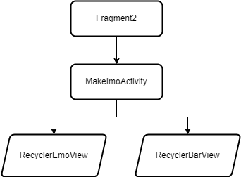

Assignment 1 week
==============================
몰입캠프 1주차 프로젝트입니다.
   
## 0. Project Name
Emoticall   
   
## 1. Member
- Jeon SeungYoon
- Lee Hyewon
   
## 2. Tab 1 - Contact View
<p>
    
    
</p>
<p></p>

1번째 Tab은 주소록을 보여주는 Tab입니다.   
한 주소록에는 이름, 전화번호, Instagram 아이디 그리고 그 사람을 나타내는 이미지가 있습니다.    
각 주소록을 옆으로 당겨 전화나 Instagram으로 연결 가능하며    
별표를 통해 중요한 사람을 최상단으로 옮길 수 있습니다.     
또한 위의 검색창을 통해 원하는 사람을 빠르게 찾을 수 있습니다.     
 
## 3. Tab 2 - Gallery View
<p>
    
    
</p>
<p></p>

2번째 Tab은 각 등록된 주소록의 사진들을 갤러리로 보여주는 Tab입니다.d   
각 이모티콘은 등록된 사용자의 소속을 의미합니다.   
이모티콘을 길게 눌러 소속의 이름을 변경할 수 있습니다.   

각 갤러리의 이모티콘(이미지)를 클릭하면 같은 이모티콘을 가지는 사람들을 세부 갤러리로 보여줍니다.   
이 갤러리에서 이모티콘을 클릭하면 그 사용자의 세부 정보를 카드로 보여줍니다.   
카드를 swipe 하면 그 사용자의 정보를 수정할 수 있습니다.   
정보를 수정한 뒤 Edit 버튼을 눌러 수정하거나, 또는 Delete 버튼을 눌러 삭제할 수 있습니다.   
   
## 4. Tab 3 - Add View
<p>
    
    
</p>
<p></p>

3번째 Tab은 주소록을 등록하는 Tab입니다.   
이모티콘을 눌러 어떻게 이모티콘을 꾸밀 것인지 선택할 수 있고   
이름, 전화번호, instagram 이름을 기입한 후 추가할 수 있습니다.
모르는 경우 공란으로 두어도 추가가 가능합니다.   

## 5. Flowchart of our project




   
## 6. License
```
    Copyright [2021] [BUYA-GH, hye1ee]

    Licensed under the Apache License, Version 2.0 (the "License");
    you may not use this file except in compliance with the License.
    You may obtain a copy of the License at

    http://www.apache.org/licenses/LICENSE-2.0

    Unless required by applicable law or agreed to in writing, software
    distributed under the License is distributed on an "AS IS" BASIS,
    WITHOUT WARRANTIES OR CONDITIONS OF ANY KIND, either express or implied.
    See the License for the specific language governing permissions and
    limitations under the License.
```