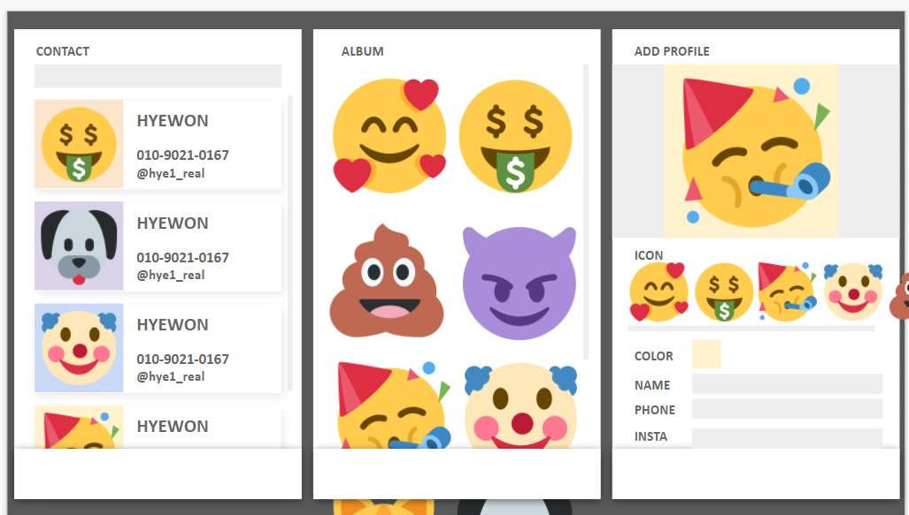

# Assignment 1 week
몰입캠프 1주차 프로젝트입니다.

## 0. Project Name
현재 미정

## 1. Member
- Jeon SeungYoon
- Lee Hyewon

## 2. Project

만들 어플의 대략적인 계획.   

탭 3개로 이루어진 이 어플은 유저들에게 친화적으로 다가가기 위해 딱딱한 text 대신 이모티콘을 더 활용했습니다.   

일반적인 주소록(연락처 앱)에서 집, 회사, 가족 등등 소집합으로 분류하던 것을   
같은 이모티콘을 가지면 같은 소집합에 분류되는 것으로 표현했습니다.   
또한 같은 이모티콘을 가지지만 배경색을 사용자로 하여금 다르게 두게 해    
같은 소집합에 속하더라도 구분할 수 있게 했습니다.

첫번째 탭에서는 일반적인 주소록의 형태를 하고 있지만   
검색창의 필터를 통해 원하는 사람의 주소록을 더욱 빠르게 접근하게 했습니다.   
두번째 탭에서는 각 저장된 연락처의 이미지를 이용해 갤러리로 구현한 것입니다.   
각 이미지를 누르면 더욱 세부로 들어가 이 이모티콘을 가진 소집합만을 보여주게 됩니다.   
세번째 탭은 연락처를 추가하기 위한 탭입니다. 아이콘, 뒷배경색, 이름, 전화번호, Insta 아이디를 입력한 후    
버튼을 누르면 자동으로 어플에 추가하게 했습니다.