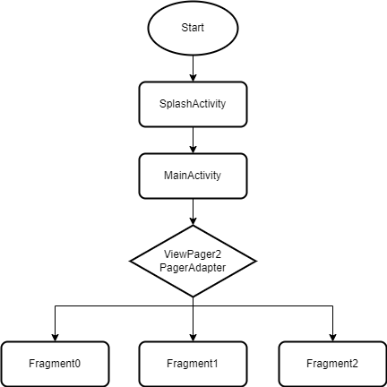
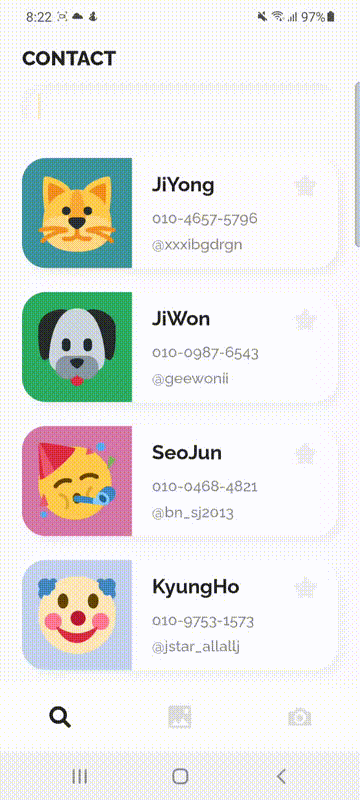

Assignment 1 week
==============================
몰입캠프 1주차 프로젝트입니다.
   
## 0. Project Name
Emo-Contact   
   
## 1. Member
- Jeon SeungYoon
- Lee Hyewon
   
## 2. Project Result
### BluePrint Image

   
탭 3개로 이루어진 이 주소록 어플리케이션은   
유저들에게 친화적으로 다가가기 위해 딱딱한 text 대신 이모티콘을 더 활용했습니다.   
   
### Tab 1 - Contact View

  
1번째 Tab은 주소록을 보여주는 Tab입니다.   
한 주소록에는 이름, 전화번호, Instagram 아이디 그리고 그 사람을 나타내는 이미지가 있습니다.   
각 주소록을 옆으로 당겨 전화나 Instagram으로 연결 가능하며   
별표를 통해 중요한 사람을 최상단으로 옮길 수 있습니다.   
또한 위의 검색창을 통해 원하는 사람을 빠르게 찾을 수 있습니다.
 
### Tab 2 - Gallery View
(Tab 2에 관한 gif와 글 넣기.)   
   
### Tab 3 - Add View
(Tab 3에 관한 gif와 글 넣기.)  
   

## 3. Implementation
(구현한 자세한 내용들)   
